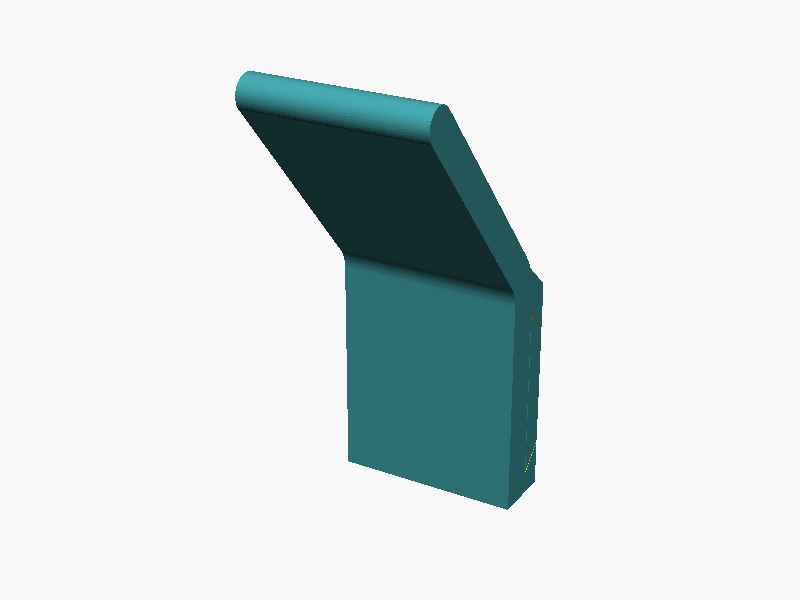

# Towel hook (screws side by side)

Variant of the two-piece towel hook for two existing wall holes at the same height (default spacing: 23 mm).

- **Plate**: screwed to the wall with 2 countersunk screws side by side. On the hook's open side it ends flush with the hook, so no gap shows.
- **Hook**: slides onto the plate from one side; its channel wraps the plate's top, bottom and front.
- **Pins** (2): one from underneath and one from the top. They have no head: their outer end is cut to the hook's own surface (flat underneath, sloped on top), so they sit flush. A flat side (D profile) keys them in D-shaped holes so they always line up. To remove the hook, screw a small screw into a pin and pull it out.
- If the holes are further apart than the hook is wide, the plate automatically becomes a rail and the hook is pinned at its center.

## Files

| File | Description |
|---|---|
| `towel_hook_side_by_side_screws.scad` | Parametric source (OpenSCAD Customizer) |
| `plate.stl` | Wall plate |
| `hook.stl` | Hook |
| `pin.stl` | Both pins (bottom and top) |

## Printing (no supports)

- Plate: back face (wall side) on the bed.
- Hook: lying on its closed side.
- Pins: lying on their flat side.

## Main parameters

`screw_spacing` (distance between the wall holes), hook width and thickness, section lengths, arm angle, bend radius, fit tolerance, pin diameter, depth and fit, `top_pin` on/off.
